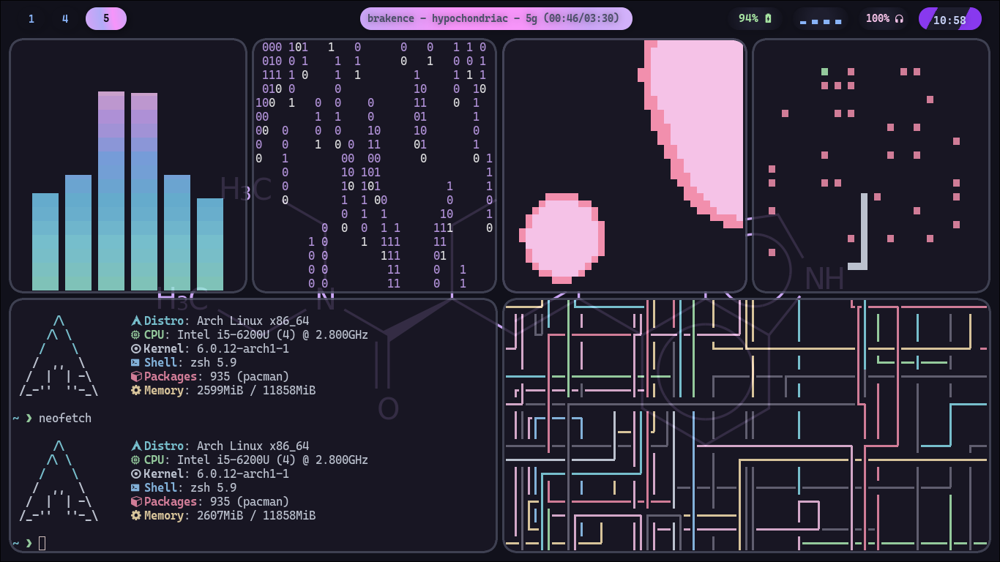
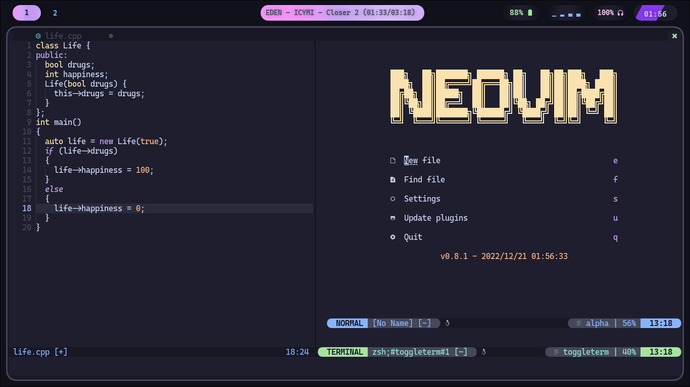
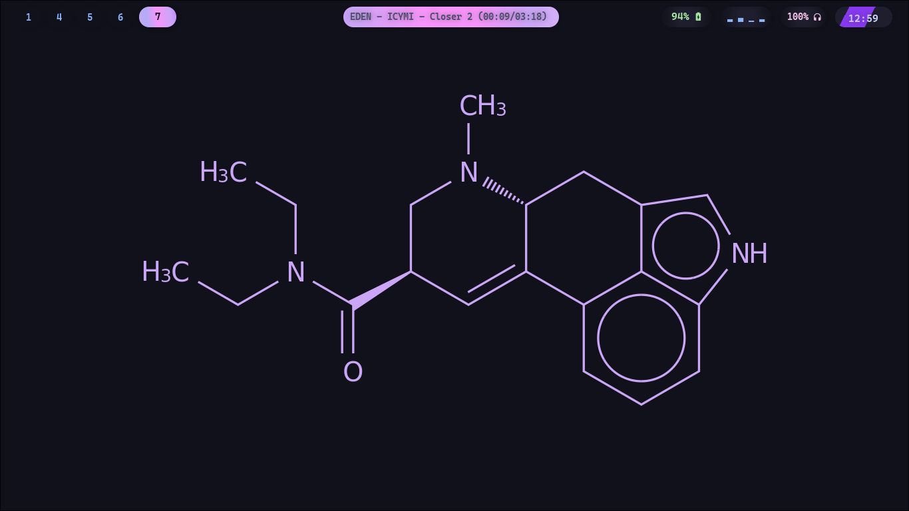

<div align="justify">

<div align="center">

```ocaml
 🌿 hyprland / lysergic_malfunction / catppuccin 🌿
```


# rice




# info
 
</div>
</div>

- huge thanks to [**flick0**](https://github.com/flick0/dotfiles) for the original theme.  
- [**catppuccin**](https://github.com/catppuccin/catppuccin) color scheme.
- with the [**hyprland**](https://hyprland.org/) window manager.
- i use [**arch**](https://archlinux.org/) btw.
- terminal is [**kitty**](https://wiki.archlinux.org/title/kitty).
- the shell is [**zsh**](https://ohmyz.sh/) with [_ohmyzsh_](https://ohmyz.sh/) addon.  
- the ides i use include [**clion**](https://www.jetbrains.com/clion/), [**pycharm**](https://www.jetbrains.com/pycharm/), [**webstorm**](https://www.jetbrains.com/webstorm/) and other [**jetbrains**](https://www.jetbrains.com/) products.  
- i use [**vsc**](https://code.visualstudio.com/) and [**nvim**](https://neovim.io/) for text-editing.
- for databases, i use [**mariadb**](https://archlinux.org/packages/extra/x86_64/mariadb/) and [**datagrip**](https://www.jetbrains.com/datagrip/).
- i use [**wofi**](https://archlinux.org/packages/community/x86_64/wofi/) as my application launcher.
- my font is [**cascadia code**](https://github.com/microsoft/cascadia-code) and [**jetbrains nerd font**](https://github.com/ryanoasis/nerd-fonts/blob/master/patched-fonts/JetBrainsMono/Ligatures/Regular/complete/JetBrains%20Mono%20Regular%20Nerd%20Font%20Complete%20Mono.ttf).
- my file explorer is [**thunar**](https://archlinux.org/packages/extra/x86_64/thunar/).
- i use [**notion enhanced**](https://github.com/notion-enhancer/desktop) for note-taking.
- to view images, i use [**imv**](https://feh.finalrewind.org/).  
- my office app is [**libreoffice**](https://www.libreoffice.org/).  
- for pdf documents, i use [**zathura**](https://pwmt.org/projects/zathura/).  
- for my emojis, i use [**wofi-emoji**](https://github.com/dln/wofi-emoji).  
- my music player is [**spotify**](https://spotify.com) with the [_spicetify_](https://spicetify.app/) addon.
- my messenger app is [**discord**](https://discord.com) with the [_betterdiscord_](https://betterdiscord.app/) addon.
- the task manager that I use is [**btop**](https://github.com/aristocratos/btop).
- fun tools include [**cowsay**](https://www.npmjs.com/package/cowsay), [**pipes.sh**](https://github.com/pipeseroni/pipes.sh), [**rusty-rain**](https://github.com/cowboy8625/rusty-rain), [**cbonsai**](https://www.cyberciti.biz/open-source/cbonsai-linux-bonsai-tree-generator-for-cli-lovers-for-fun/), [**CAVA**](https://github.com/karlstav/cava), [**lavat**](https://github.com/AngelJumbo/lavat) and [**sssnake**](https://github.com/AngelJumbo/sssnake), [**tty-clock**](https://github.com/xorg62/tty-clock) and [**pokemon-colors**](https://aur.archlinux.org/packages/pokemon-colorscripts-git).

## Config

All of the folders go in `~/.config/`.  
Place the `.zshrc` at `~/`.   
The neofetch ASCII art must be replaced in the neofetch file.  
VSCode instructions can be read in the folder.
